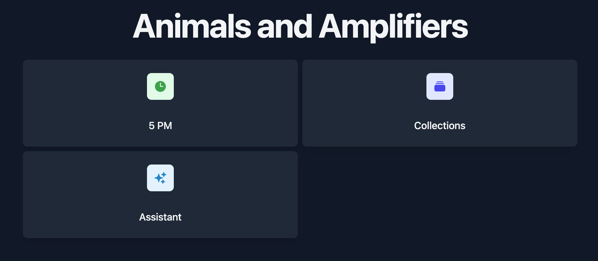

**Project Overview:**
Animals and Amplifiers is a collection of digital tools designed to be simple, focused, and useful. Tools should work for a person, not for the company trying to sell more tools.

## Objectives

1. Create simple tools that are useful to humans.

## Tools

### Collections

- People can create collections of things. These collections can be private or shared with others.
- In the future, we intend to support group collections to support resource sharing. For example, maybe 5 leaf blowers for a 20 home neighborhood is enough if there's a simple way to share those leaf blowers.

### 5 PM

- It's 5 PM somewhere.

## Technology Stack

- Frontend: SvelteKit
- Backend: SvelteKit
- Database: PostgreSQL
