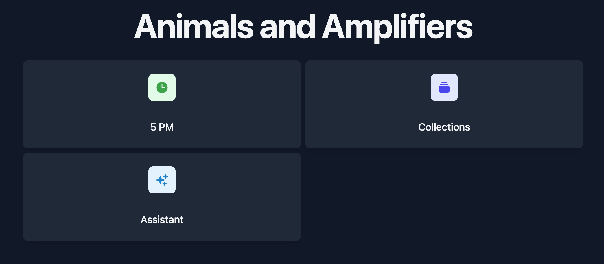

Animals and Amplifiers is a set of small tools that share one account and one deploy. It runs at [animalsandamplifiers.com](https://www.animalsandamplifiers.com).

## The Problem

Most tools that do one small thing don't stay that way. They grow a feed, or a plan you didn't ask for, because the tool is there to grow. I wanted a few that do the thing and stop.

The catch is that even a small tool needs accounts, sessions, password resets, email verification, a database, and somewhere to deploy. That is most of the work and none of the idea, and it is why the small ideas never got built. So these share all of it.

## What It Does

- **Blocks**: a time budget instead of a task list. You record a block of focused work after finishing it and tag it with a label. Plans set a target for a label over a date range, like five blocks of cleaning this weekend. Five blocks of cleaning is five blocks not spent on something else, and the plan puts that in front of you. History shows up as a grid of colored squares with streak counts.
- **Collections**: lists of things, with a description and colored tags on each item. A collection is private or public, and public ones can be browsed without an account.
- **5 PM**: it's 5 PM somewhere. Finds a timezone where it currently is, counts the seconds, and links the place on a map. No account needed.

## One Shell, Several Tools

Each tool is a route in one SvelteKit app, switched on by a list in config. Production runs `['fivepm', 'collections', 'blocks']`. The home page renders a card per enabled tool, so a tool appears or disappears with its flag. There is also an AI assistant in the codebase, an agent loop with a tool registry over the OpenAI API, currently off.

Auth is shared and hand-rolled: session tokens hashed in Postgres, Argon2id for passwords, HTTP-only cookies, thirty-day sessions that refresh at fifteen. Adding a tool means a route, a table or two in the Drizzle schema, and a flag.

## Technology Stack

- Frontend and backend: SvelteKit 2 with Svelte 5 runes, TypeScript
- Database: PostgreSQL with Drizzle ORM
- Styling: Tailwind CSS
- Auth: custom session-based, Argon2id
- Hosting: Vercel
