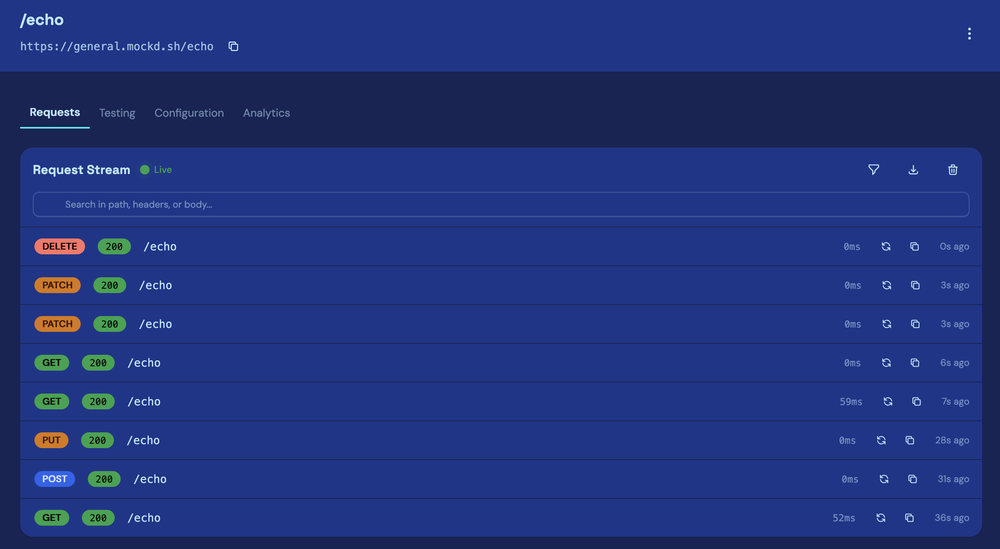

mockd is a mock API server for developers waiting on a backend that doesn't exist yet. Describe an endpoint, get a live URL, point your app at it. It runs at [mockd.sh](https://mockd.sh), with docs at [docs.mockd.sh](https://docs.mockd.sh). The free tier is a working product rather than a demo; paid plans add projects, endpoints, request volume, and longer log retention.

## The Problem

Frontend work stalls waiting on an API. Fixtures and local stub servers work for a while, but they drift from the real API and only help the person who wrote them. Hosted mocks are better, but most make you sign up first.

## What It Does

- **No signup**: create a project without an account and you get a subdomain and a claim token. Sign up later and the token attaches the project to your account.
- **Endpoints**: a method, a path, a response body. Status defaults to 200, content-type to JSON.
- **Rules**: return different responses based on the request, so you can test error paths without editing the mock.
- **Template variables**: 35 built-ins like `{{$uuid}}`, `{{$randomEmail}}`, and `{{$timestamp}}`, plus values from the request like `{{request.body.email}}`. A `{{#repeat:N}}` block generates arrays. It's string substitution, not evaluation.
- **Live request log**: every request streams into the dashboard over a WebSocket. This is what most people use mockd for.

## How It's Built

Two Cloudflare Workers that deploy separately. The API worker is the dashboard: authenticated, low volume, metadata in D1. The endpoint worker is the mocks: unauthenticated, bursty, routed by subdomain. A dashboard deploy can't take down a live mock.

Every project gets its own SQLite database inside a Durable Object. The same object serves the mock requests and holds the dashboard's WebSocket, which is why the live log needed no queue or pub/sub layer.

## Technology Stack

- Runtime: Cloudflare Workers, Durable Objects
- Backend: Hono (TypeScript)
- Frontend: React, Vite, Tailwind CSS, daisyUI
- Storage: D1 for metadata, Durable Object SQLite for per-project data
- Build: pnpm workspaces, Turborepo
